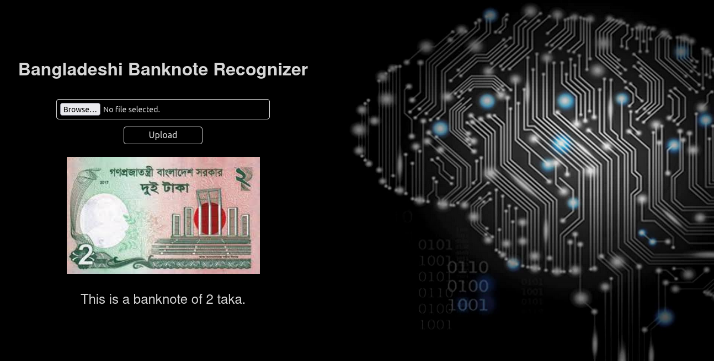

# Bangladeshi Banknote Recognizer

<p aligh="justify"><b>Bangladeshi Banknote Recognizer</b> is an web application which can recognize 8 different Banknotes of Bangladesh. It can recognize banknotes of 2 taka, 5 taka, 10 taka, 20 taka, 50 taka, 100 taka, 500 taka and 1000 taka. This is <b>Deep Learning</b> based application. I have usd a <a href="https://www.kaggle.com/rahnumatasnim1604103/bangladeshi-banknote-dataset">dataset</a> to train a <b>Convolutional Neural Network</b>. The dataset contains more than 70K images of 8 different banknotes. I have used 50K images for training and validation and 20K images for testing and tuning.</p>



<br>

---

## Thecnical Details

### Dataset
Total Images: 70,500+<br>
Format: png<br>
Resolution: 256 x 117<br>
Color: RGB<br>

### Install
- Python
- OpenCV
- Numpy
- Tensorflow
- Flask

### Installation
I am assuming you have Python3 installed in your environment. Now follow the instructions to run this project.
1. Clone the repository.
```
git clone https://github.com/mhshesher/Bangladeshi-Banknote-Recognizer.git
```
2. Install the requirements.
```
pip install -r requirements.txt
```
4. Run the `app.py` file.
```
python3.8 app.py
```
5. Enjoy

---

**You are welcomed, If you want to learn.**
